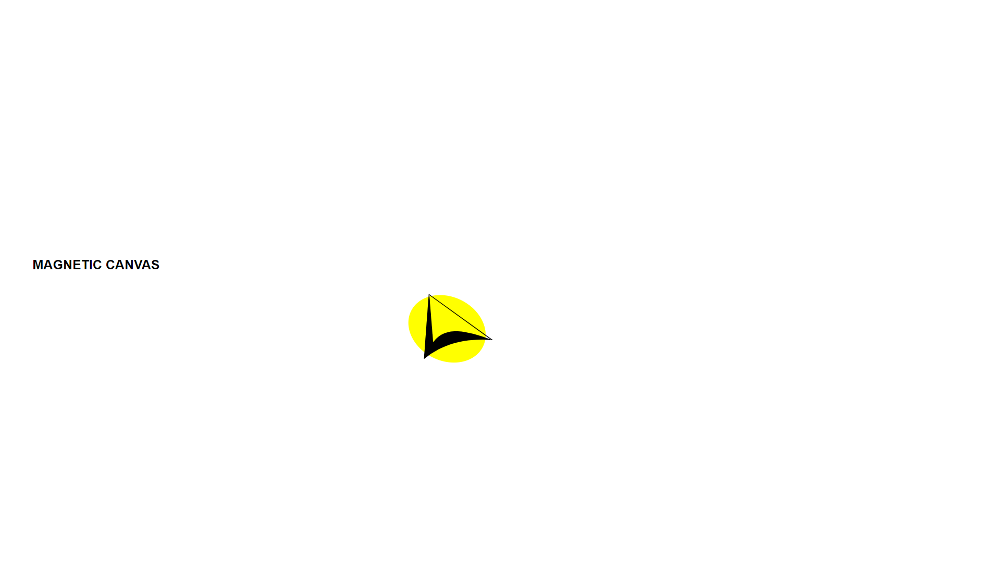

# Canvas tricks
> Magnetic, Jelly effect, responsive Circle Collision 🐳

#How to use

Clone this repo and then in command line type:

* `npm install` or `yarn` - install all dependencies
* `gulp` - run dev-server and let magic happen, or
* `gulp build` - build project from sources

--

## List of Gulp tasks

To run separate task type in command line `gulp [task_name]`.
Almost all tasks also have watch mode - `gulp [task_name]:watch`, but you don't need to use it directly.

### Main tasks
Task name          | Description
:------------------|:----------------------------------
`default`          | will start all tasks required by project in dev mode: initial build, watch files, run server with livereload
`build:dev`        | build dev version of project (without code optimizations)
`build`            | build production-ready project (with code optimizations)

### Other tasks
Task name          | Description
:------------------|:----------------------------------
`sass` 	         | compile .sass/.scss to .css. We also use [postcss](https://github.com/postcss/postcss) for [autoprefixer](https://github.com/postcss/autoprefixer) and [Lost](https://github.com/peterramsing/lost), so feel free to include other awesome postcss [plugins](https://github.com/postcss/postcss#plugins) when needed
`webpack`          | compile .js sources into bundle file
`copy`             | copy common files from `./src` path to `./build` path
`swig`             | compile [swig](http://paularmstrong.github.io/swig/)  templates
`nunjucks`         | compile Mozilla's awesome [nunjucks](https://mozilla.github.io/nunjucks/) templates
`jade`             | compile [jade](http://jade-lang.com/) templates
`svgo`             | optimize svg files with [svgo](https://github.com/svg/svgo)
`iconfont`         | compile iconfonts from svg sources
`sprite:svg`       | create svg symbol sprites ([css-tricks](https://css-tricks.com/svg-sprites-use-better-icon-fonts/))
`sprite:png`       | create png sprites
`server`           | run dev-server powered by [BrowserSync](https://www.browsersync.io/)
`clean`            | remove `./build` folder
`list-pages`       | create index file with links to all project pages

_This is a full list of tasks, that we use in our projects, but not all of them should be available in current project. For example, we only use one template engine out of these three [`jade`, `nunjucks`, `swig`]. All available tasks are placed in a folder `./gulp/tasks` as separate *.js files. Usually, file name = task name._

## Flags

We have several useful flags.

* `gulp --open` or `gulp server --open` - run dev server and then open preview in browser
* `gulp --tunnel=[name]` or `gulp server --tunnel [name]` - runs dev server and allows you to easily share a web service on your local development machine (powered by [localtunnel.me](https://localtunnel.me/)). Your local site will be available at `[name].localtunnel.me`.
* `gulp [task_name] --prod` or `gulp [task_name] --production` - run task in production mode. Some of the tasks (like, sass or js compilation) have additional settings for production mode (such as code minification), so with this flag you can force production mode. `gulp build` uses this mode by default.

##Other
You can also use [npm scripts](https://docs.npmjs.com/misc/scripts):

* `npm run start` - same as `gulp default`.
* `npm run build` - same as `gulp build`.
* `npm run ghpages` to push only `./build` folder to **gh-pages** branch on github (very useful for previews).
* `npm run lint` - linting javascript with **eslint**.
* `npm run lint-fix` - fix as many issues as possible relatives to **eslint** settings.
